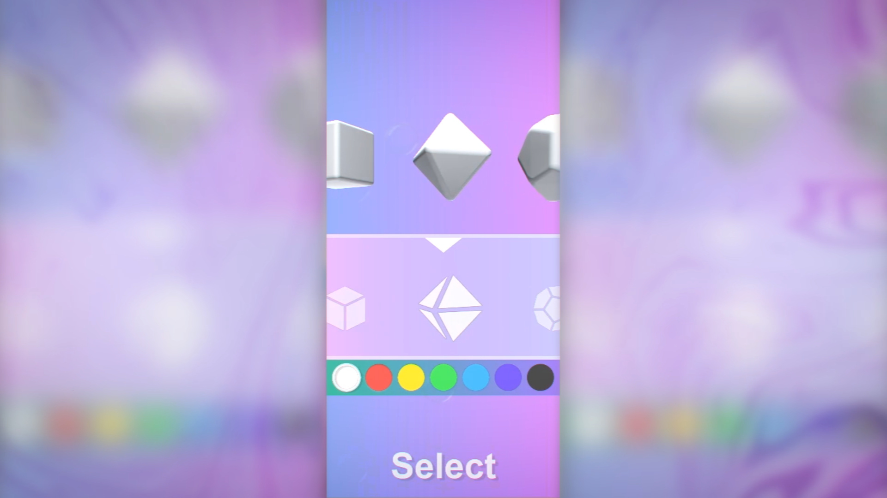

# UIScroll3DPlatonicSolids
Template for choosing a Platonic solids (regular polyhedra) and its color.

There are 5 models and their sprites available in total:
- Tetrahedron;
- Hexahedron;
- Octahedron;
- Dodecahedron;
- Icosahedron.

Supported platforms: Android/IOS

Models count: 5

# Screenshots

